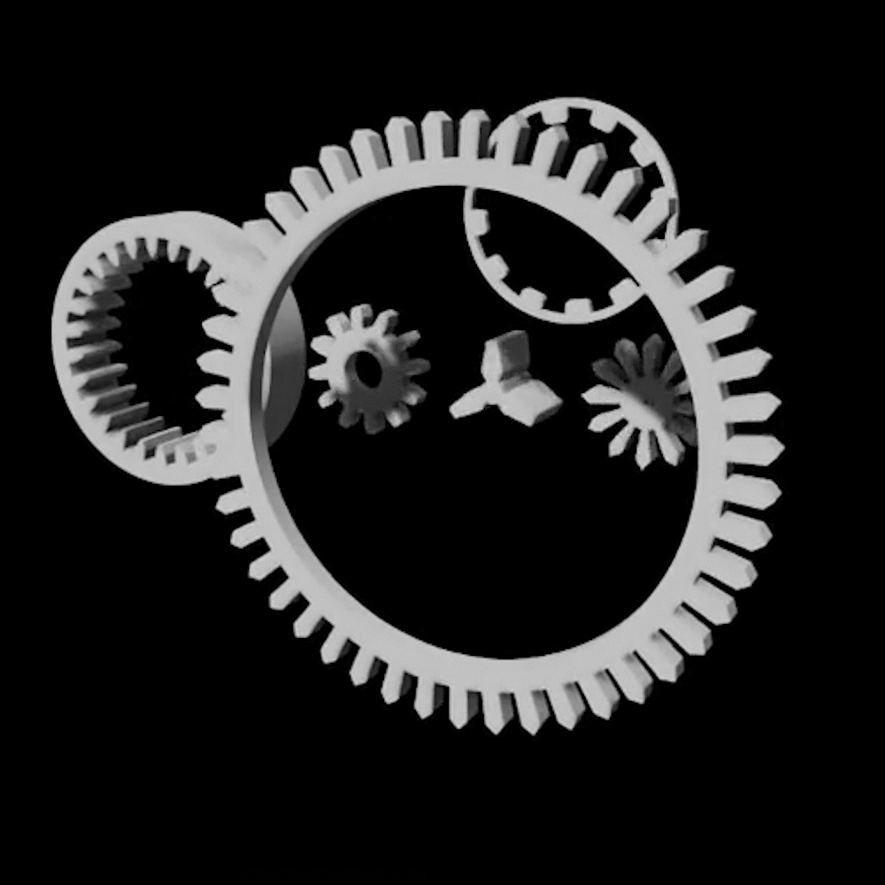

# GearSimulator

<div>
    
    
</div>

This extension allows to simulate gears with exact physics in Omniverse.

This repository is inspired by [blender](https://www.blender.org/).

Gear analysis is fun but hard. Without getting connect to good physics, the gear simulation cannot be performed accurately. We provide this extension `Gear Simulator` in Omniverse to support customized gear with customized analysis.

# Get started with Omniverse Code/Create [version >= 2022]

## Download the [release](https://github.com/yizhouzhao/GearSimulator/releases/tag/0.2) or clone the this repository 

```
git clone https://github.com/yizhouzhao/GearSimulator
```

Upzip or locate the root folder as <your-path-to-GearSimulator>

The file structure of this extension should look like:

```
<your-path-to-GearSimulator>
    └───exts    [Omniverse extenstion]
         └───gear.simulator
                └───config  [Extension config]
                └───icons   [Extension icons]
                └───gear/simulator   [source code]
    └───img   
    │   .gitignore 
    │   README.md  
    ......
```